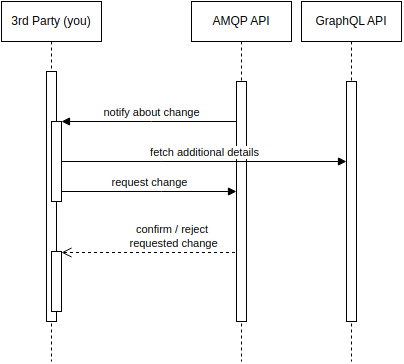

# GREM Developer guide

## Purpose

This is the starting point for developers who wish to integrate their systems with GARAIO REM.

## Getting started / getting access / getting help

Please contact us at <info@garaio-rem.ch>.

## Integration pattern

GREM provides an synchronous API for reads and an asynchronous API for event subscriptions and writes.

The read API is a GraphQL interface ("the GraphQL API"), event subscriptions and writes use AMQP messaging ("the Message Bus API").

Thus, a use case might look like this:

AMQP Events published by GREM will contain only basic additional information about the event for convenience. Depending on your use case, you can retrieve any additional required information via GraphQL.

## Further documentation

* [The GraphQL API documentation](https://github.com/Garaio-REM/grem-graphql-api)
* [The Message Bus API documentation](https://github.com/Garaio-REM/remcloud-message-bus-api)

## How to update this guide

Diagrams are created using drawio. Add the `*.drawio` files to the repository and use `./refresh-diagrams` to export them all to png.
